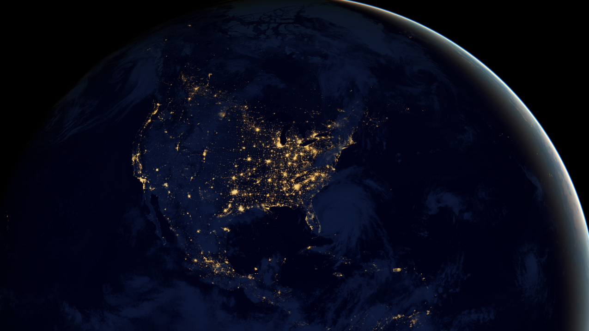
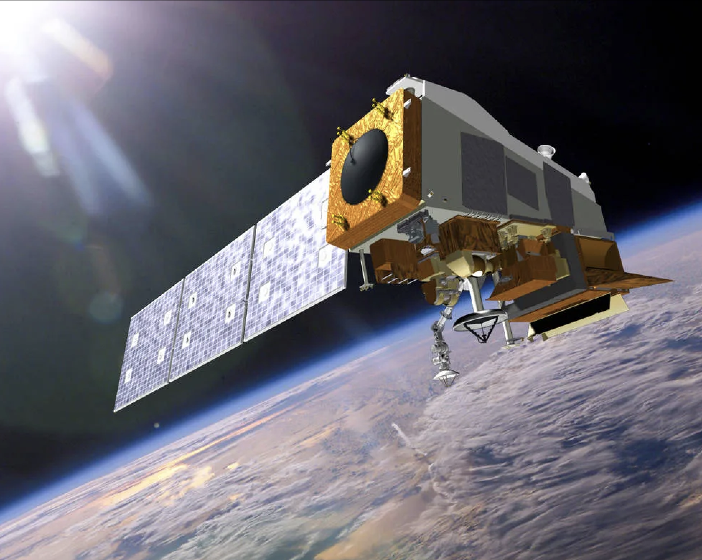
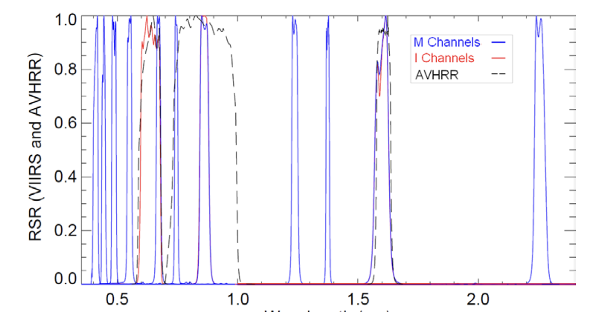
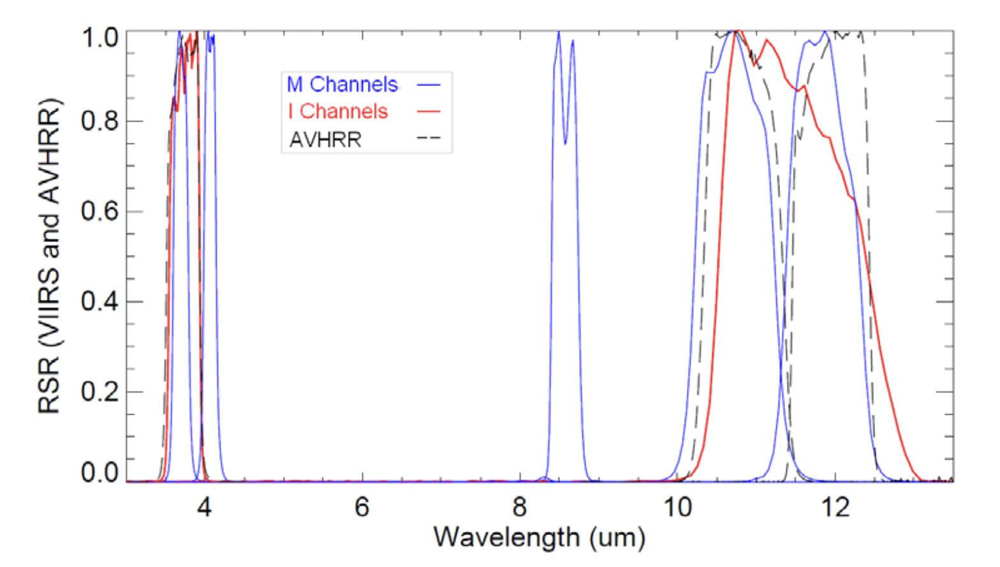

```{r setup, include=FALSE}
options(htmltools.dir.version = FALSE)

library(RefManageR)
BibOptions(check.entries = FALSE,
           bib.style = "authoryear",
           cite.style = "authoryear",
           style = "markdown",
           hyperlink = TRUE,
           dashed = FALSE,
           no.print.fields=c("doi", "url", "urldate", "issn"))
myBib <- ReadBib("./Bib.bib", check = FALSE)

library(knitcitations)
```

```{r xaringan-themer, include=FALSE, warning=FALSE}
# library(xaringanthemer)
# style_mono_light(
#   base_color = "#23395b",
#   header_font_google = google_font("Josefin Sans"),
#   text_font_google   = google_font("Montserrat", "300", "300i"),
 #  code_font_google   = google_font("Fira Mono")
# )
```

# What is VIIRS?

.pull-left[
* **Visual Infrared Imaging Radiometer Suite**
* Owned and operated by NASA and NOAA (National Oceanic and Atmospheric Administration)
* Collects Environmental Data Records -
`r Citet(myBib, "noaaNOAATechnicalReport2013")`
* Instrument is on two Satellites 
  * Suomi NPP - Launched 28 October 2011 from Vandenberg Air Force Base
  * NOAA-20 - Launched 10 November 2017 from Vandenberg Air Force Base
  
* Monitors a number of phenomena including:
  * Light Emissions (Earth at Night)
  * Ocean Colour and Aerosols
  * Cloud Particle Size and Cloud Cover
  * Fires
]

.pull-right[
```{r, echo = FALSE, out.width='90%', fig.align='center'}
  
```

.center[Composite of Earth at Night - `r Citet(myBib, "noaaOurEarthNight2012")`]

```{r, echo = FALSE, out.width='90%', fig.align='center'}
  
```

.center[Suomi NPP Satellite - `r Citet(myBib, "nasaSuomiNPPNASA")`]

]
---

# Specifications

.pull-left[
**Spectral Resolution**: 
  * Monitors 20 wavelength bands in the visual and infrared portions of the electromagnetic spectrum
  * Frequency range is 0.4 - 12.49µm
  * Most bands are visible or near infrared

**Temporal Resolution**: 
  * Entire surface of the earth is captured twice a day between the two satellites.
  * Generated products range from daily to yearly.

**Spatial Resolution**:
  * 375m for Ocean Colour/Aerosol Bands
  * 750m for other bands
  * Products also resampled to 500m, 1000m, and 5600m for use across larger areas

`r Citet(myBib, "usgsLPDAACVIIRS")`

]

.pull-right[
```{r, echo = FALSE, out.width='90%', fig.align='center'}
  
```

.center[EM Reflective Bands of VIIRS - `r Citet(myBib, "noaaNOAATechnicalReport2013")`]

```{r, echo = FALSE, out.width='90%', fig.align='center'}
  
```

.center[EM Thermal Bands of VIIRS - `r Citet(myBib, "noaaNOAATechnicalReport2013")`]

]

---

# Applications of VIIRS

.pull-left[
**Fire Monitoring**: 
  * Using VIIRS 375m products for fire detection - `r Citet(myBib, "olivaAssessmentVIIRS375m2015")`
  * M13 Longwave Infrared (3.97-4.13µm) designed to identify fires
  * VIIRS has higher sensitivity to small fires versus other products like Landsat (some dependency on ecosystem type being observed)
  * Twice daily visits to areas of interest is useful for mapping quickly evolving fires
  * VIIRS assessments of long term fires in California is consistent with airborne measurement

```{r, echo = FALSE, out.width='90%', fig.align='center'}
  knitr::include_graphics('img/Fires2020.jpg')
```

.center[Cumulative Fire Intensity for 2020 - `r Citet(myBib, "nasaSVSActiveFires")`]
]

.pull-right[

**Light Emissions**: 
  * Light Emissions data as a proxy for economic activity? - `r Citet(myBib, "mellanderNightTimeLightData2015")`
  * Day-Night Band (0.5 - 0.5µm) designed to capture lights from Earth's surface at night
  * Is often used to measure urban development (`r Citet(myBib, "floridaRiseMegaregion2008a")`) but can it be applied to estimate the extent of economic activity?
* Mellander et al. attempt to calculate local economic activity in Sweden using light emissions data
  * Find it is a better indicator of urbanisation than economic activity, for which it is more weakly correlated.

* Better tool for estimating population than any daytime datasets - `r Citet(myBib, "mellanderNightTimeLightData2015")`)
]


---
class: title-slide, top, left, inverse
background-image: url('img/Lights.png')
background-size: cover
text-color: red

# Reflection

### Most of my previous experience with VIIRS was exclusively working with the light emissions band on board

### The high spectral and temporal resolution with a specific focus on environmental variables makes VIIRS an incredible sensing tool which, in my opinion, often flies under the radar in comparison to the more popular Landsat and Sentinel platforms

### I'd be particularly interested in seeing how VIIRS can be deployed as a marine monitoring tool and investigate how its ocean colour and sea surface temperature capabilities could be used in climate studies.

Image from `r Citet(myBib, "nasaEOSDISWorldview")`

---

# References

```{r, results='asis', echo=FALSE}
PrintBibliography(myBib, start = 1, end = 9)
```
